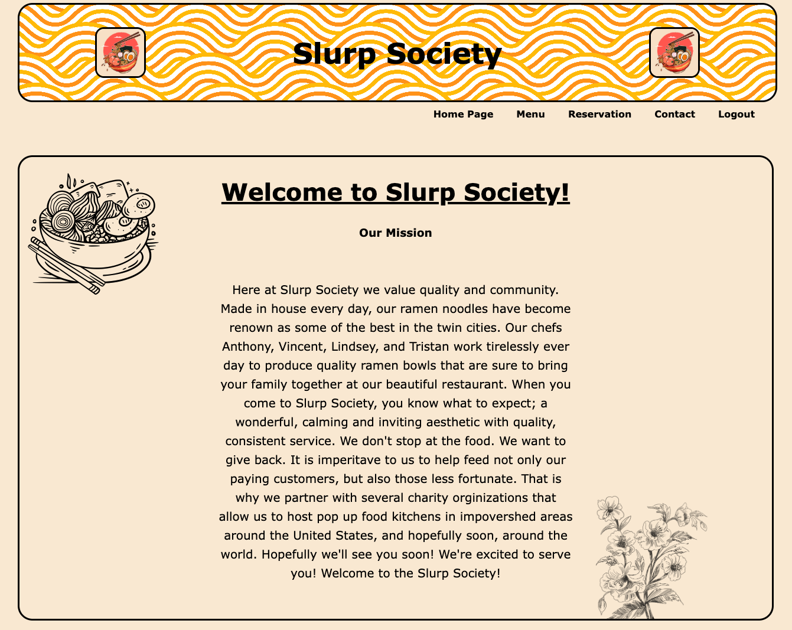
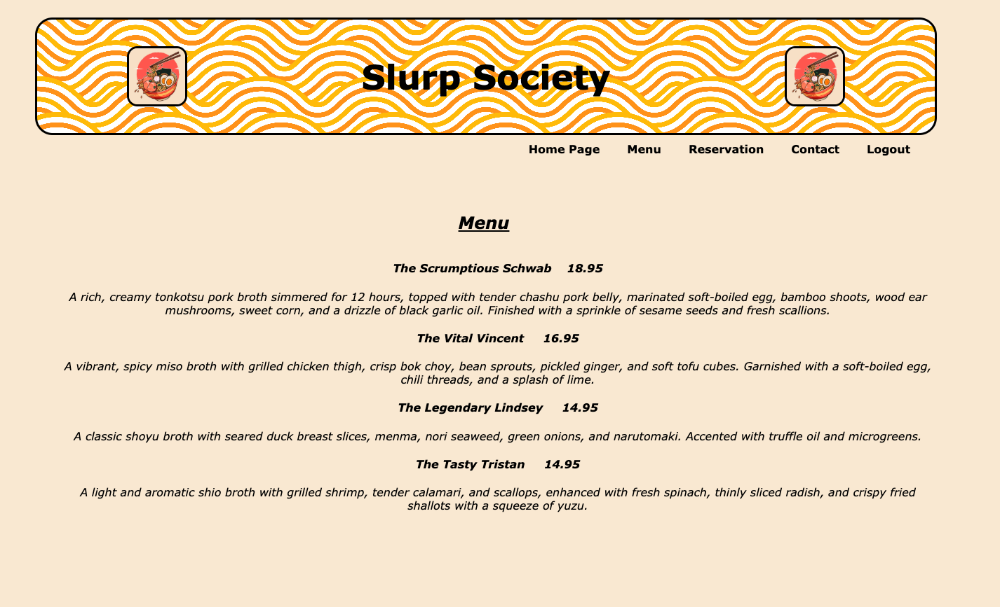
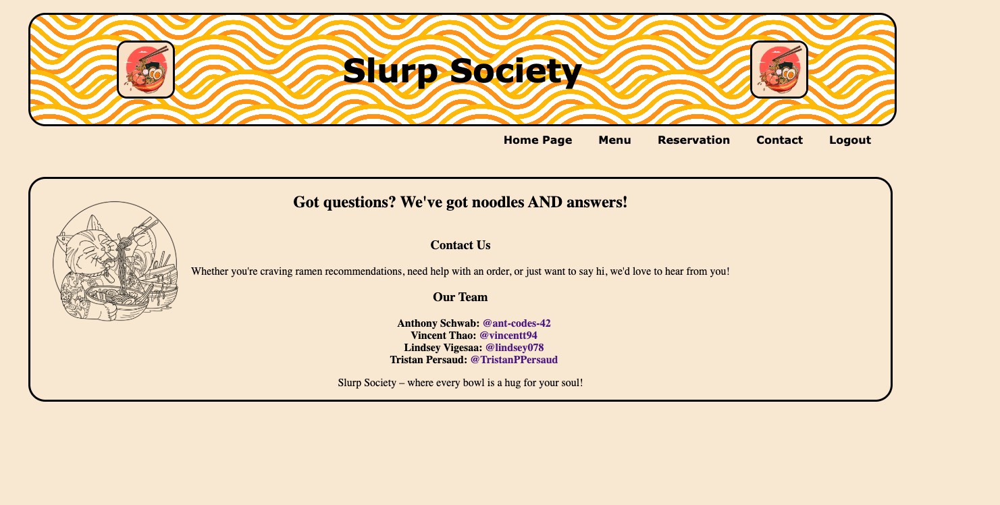
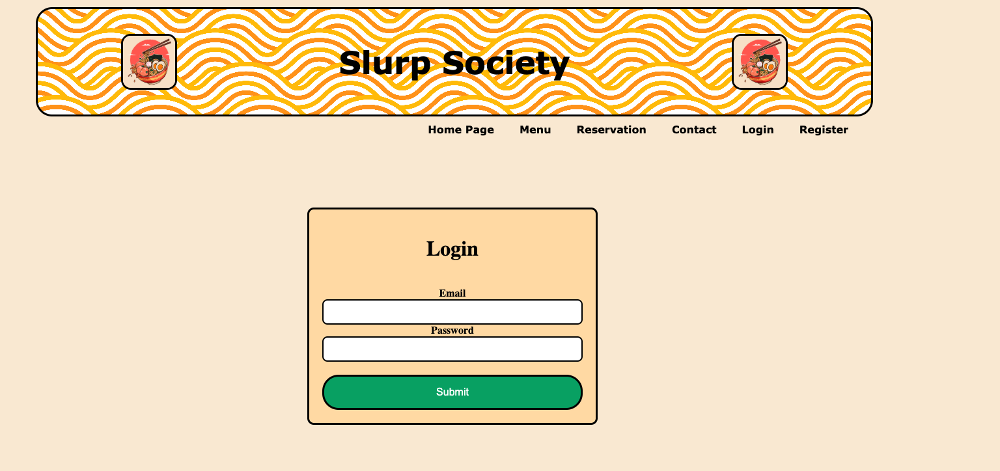
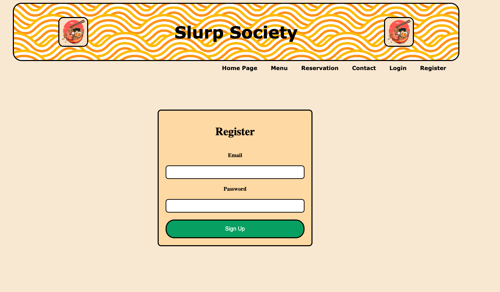
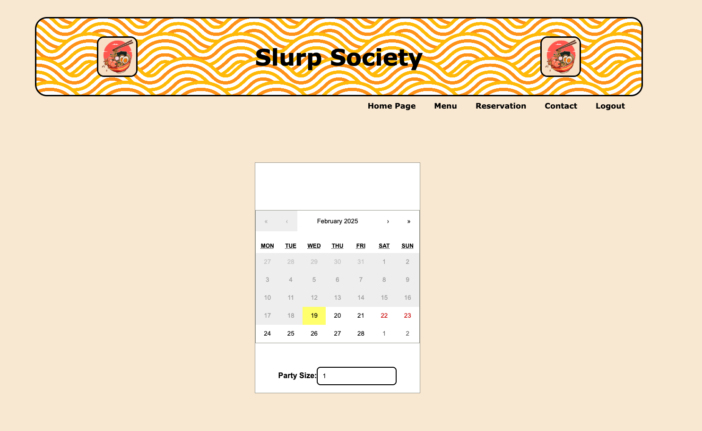
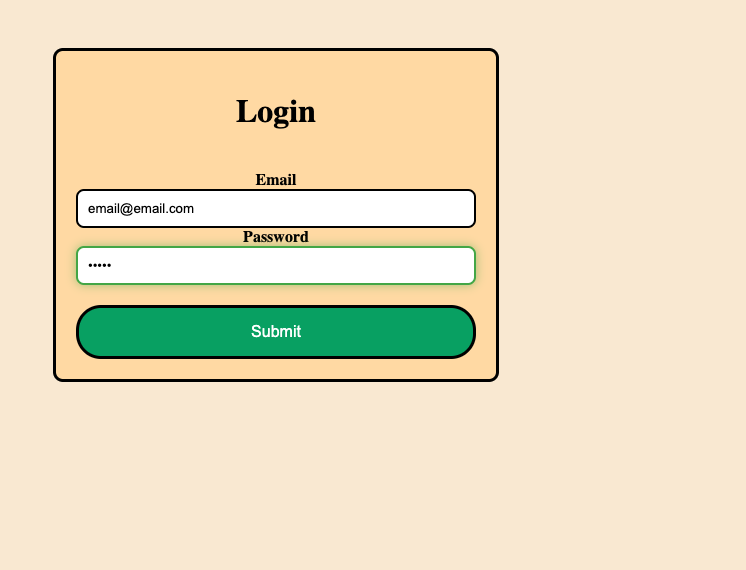
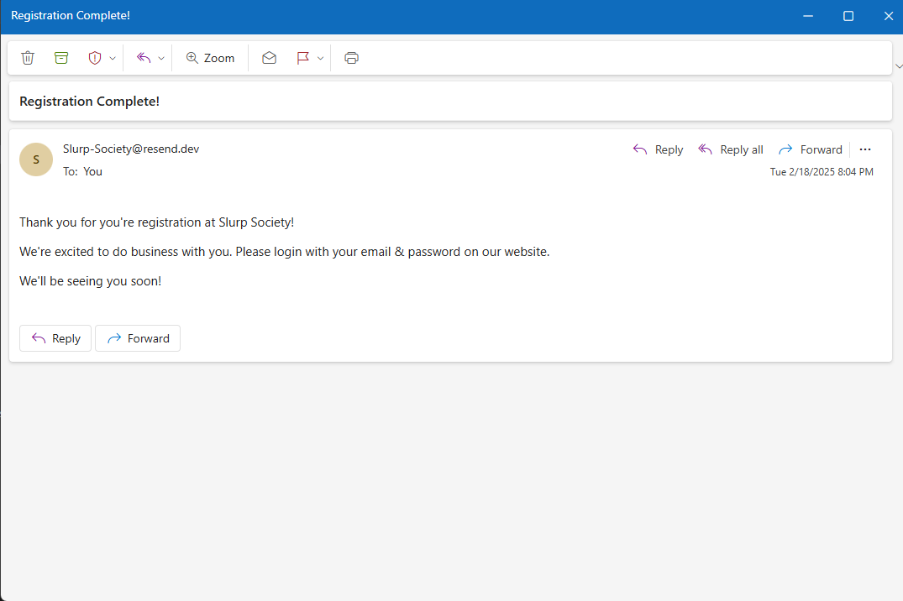

# Slurp-Society

## Description

The Slurp Society project was created to solve the complex nature many resturant owners face of providing an intuitive easy to use website that allows users to
register, login, navigate through the website, make a reservation, and recieve confirmation that their reservation has been secured. This aims to reduce that complexity
by using an API (Resend API) that provides instant feedback when a user submits a request for a reservation, a React Calendar that assists in providing a physical representation
of what dates and number of seats are available. This project was built as a means of reinforcing our skills as developers. In creating this project we implemented an API that assists
in sending data to the user, intergrated a database that will store and retrieve user login data, and reservation data. This project means to simplify the relationship between restaurants
and their patrons. It provides an intuitive interface that will allow users to navigate availability within a restaurant's open reservations through registering with the restaurant.
Slurp Society has strengthened all the skills to necessary to integrate a system like this including creating a database with postSQL and sequalize, using an API to send confirmation emails, requiring authentication through JWT, and making a full stack React application.

## Installation

No installation necessary.

## Usage

A user navigates to the website.

The user may look at the reservations page, the home page, the menu page,  the contact page, the login page, and the register page.

If the user wishes to make a reservation they must log in.

The user recieves a confirmation email that they have been successfully registered.

If the user doesn't have an account they must make an account to log in.
(insert image)

The user can interact with the calendar on the reservations page to view all days with available reservation, and theyre corresponding time slots.
(insert image)

The user can select a reservation.
(insert image)

The user gets confirmation on the website that their reservation has been successful.
(insert image)

## Credits

Main Developers:

Anthony Schwab
Github: https://github.com/ant-codes-42

Vincent Thao
Github: https://github.com/vincentt94

Lindsey Vigeesa
Github: https://github.com/lindsey078

Tristan Persaud
Github: https://github.com/TristanPPersaud

Image Credits:

ramen-image.jpg:
Pikisuperstar
freepik: https://www.freepik.com/author/pikisuperstar

pasta-background.jpg:
redgreystock
freepik: https://www.freepik.com/author/redgreystock

ramen-bowl.jpg:
freepik
freepik: https://www.freepik.com/author/freepik

cherry-blossom.jpg:
Harryarts
freepik: https://www.freepik.com/author/harryarts

ramen-cat:
doddy77
vecteezy: https://www.vecteezy.com/members/doddy77

Documentation Credits:

React Calendar Styling
Author: Kenny Fitzgerald
https://dev.to/fitzgeraldkd/react-calendar-with-custom-styles-30c9

CSS buttons
W3schools
https://www.w3schools.com/css/css3_buttons.asp

## License

MIT License

## How to Contribute

If you would like to contribute to Slurp Society please contact any of the main developers with your intent on contributing, how you would implement those contributions, and why 
the contributions may be necessary or what they might improve.